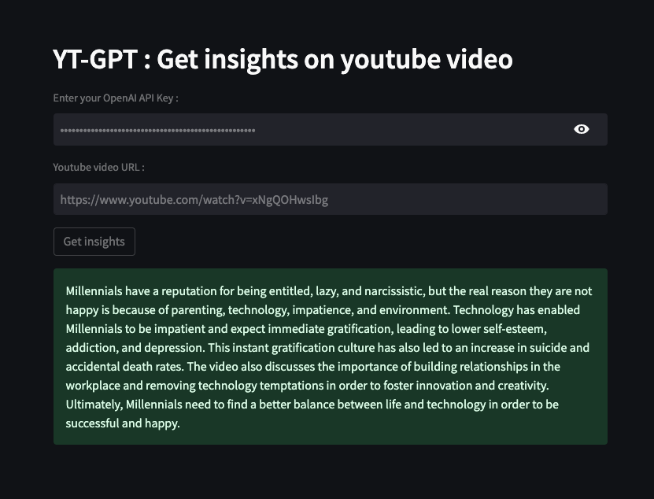

# YT-GPT : Youtube Insights App
Get insights on YouTube videos using OpenAI's GPT and langchain.

### Screenshot

# Installation 💥

To run this application, you need to have Python 3.10+ installed on your machine. Once you have Python installed, you can clone this repository and install the required packages by running:

- Clone the repository:
`git clone https://github.com/royca/yt-gpt.git`
- Navigate to the project directory:`cd yt-gpt`
- Install the required dependencies:
`pip install -r requirements.txt`

# Usage ✨

To start the application, run the following command:

`streamlit run main.py`

# Features 🚀
The application offers the following features:

* Powered by OpenAI's GPT Turbo model
* Uses langchain to load the youtube video and summarize the content
* Generates short summary of the youtube video
* Easy to use: The app has a simple and intuitive user interface that makes it easy for users to add thier openAI API key and youtube video to get insights.

# Contributing 🤝
Contributions are always welcome! If you want to contribute to this project, please follow these steps:

* Fork this repository.
* Create a new branch with your feature or bug fix.
* Commit your changes and push them to your fork.
* Submit a pull request.

# Author 📝

Please feel free to contact me with any issues, comments, or questions.

####  

# How to support this project ❤️

You can support the project by buying me a coffee ☕️.

If you find this project helpful, please consider giving it a star⭐ on GitHub and sharing it with others who might benefit from it. 
  
Your support helps keep this project alive and enables me to continue improving it. 

Thank you!😊

# License

The Youtube Insights app is released under the MIT License.
